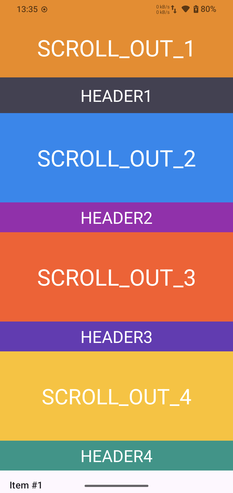
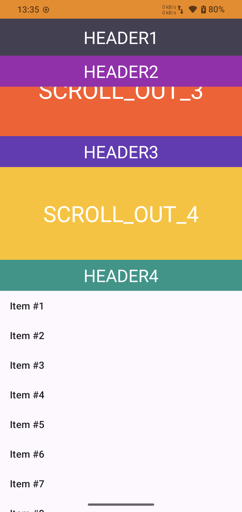
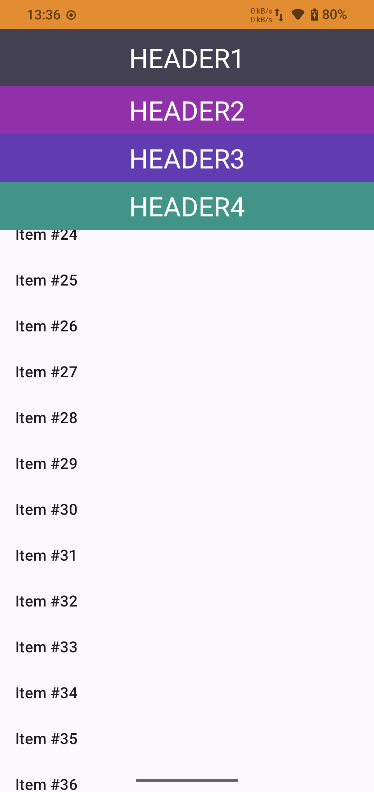

# StickyHeaders

<p align="center">
  
  
  
</p>

---

[](https://jitpack.io/#SherlockGougou/StickyHeaders)
[](https://opensource.org/licenses/Apache-2.0)

[English](#english) | [中文](#中文)

---

## English

A lightweight Android library for implementing **multi-level sticky headers** using `AppBarLayout` and `CoordinatorLayout`. Unlike traditional
approaches that require complex custom Behaviors, this library achieves the sticky effect by intelligently offsetting child views during scroll.

### ✨ Features

- 🎯 **Multi-level sticky headers** - Support unlimited number of sticky headers
- 📱 **Easy to use** - Just add `app:layout_pin="true"` to your views
- 🔄 **Works with AppBarLayout** - Seamlessly integrates with Material Design components
- ⚡ **Lightweight** - Minimal overhead, no complex calculations
- 🎨 **Flexible** - Mix sticky and non-sticky views freely

### 📦 Installation

**Step 1.** Add the JitPack repository to your root `settings.gradle.kts`:

```kotlin
dependencyResolutionManagement {
    repositories {
        // ...existing repositories...
        maven { url = uri("https://jitpack.io") }
    }
}
```

**Step 2.** Add the dependency to your module's `build.gradle.kts`:

```kotlin
dependencies {
    implementation("com.github.SherlockGougou:StickyHeaders:1.0.1")
}
```

### 🚀 Quick Start

#### 1. Add to your layout

```xml
<?xml version="1.0" encoding="utf-8"?>
<androidx.coordinatorlayout.widget.CoordinatorLayout xmlns:android="http://schemas.android.com/apk/res/android"
    xmlns:app="http://schemas.android.com/apk/res-auto" android:layout_width="match_parent" android:layout_height="match_parent">

    <com.google.android.material.appbar.AppBarLayout android:layout_width="match_parent" android:layout_height="wrap_content">

        <!-- This view will scroll out -->
        <TextView android:layout_width="match_parent" android:layout_height="200dp" android:text="Scroll Out" app:layout_scrollFlags="scroll|snap" />

        <!-- StickyLinearLayout contains sticky headers -->
        <com.gouqinglin.stickyheader.lib.StickyLinearLayout android:layout_width="match_parent" android:layout_height="wrap_content"
            android:orientation="vertical" app:layout_scrollFlags="scroll|exitUntilCollapsed">

            <!-- Sticky Header 1 -->
            <TextView android:layout_width="match_parent" android:layout_height="50dp" android:text="HEADER 1" app:layout_pin="true" />

            <!-- This view will scroll out -->
            <TextView android:layout_width="match_parent" android:layout_height="100dp" android:text="Content" />

            <!-- Sticky Header 2 -->
            <TextView android:layout_width="match_parent" android:layout_height="50dp" android:text="HEADER 2" app:layout_pin="true" />

        </com.gouqinglin.stickyheader.lib.StickyLinearLayout>

    </com.google.android.material.appbar.AppBarLayout>

    <androidx.recyclerview.widget.RecyclerView android:id="@+id/recycler" android:layout_width="match_parent" android:layout_height="match_parent"
        app:layout_behavior="@string/appbar_scrolling_view_behavior" />

</androidx.coordinatorlayout.widget.CoordinatorLayout>
```

#### 2. Key points

- Use `StickyLinearLayout` inside `AppBarLayout`
- Set `app:layout_scrollFlags="scroll|exitUntilCollapsed"` on `StickyLinearLayout`
- Add `app:layout_pin="true"` to views that should stick

### 📖 Attributes

**Container Attributes (`StickyLinearLayout`):**

| Attribute        | Format | Default | Description                                                   |
|------------------|--------|---------|---------------------------------------------------------------|
| `app:stickyMode` | enum   | `multi` | `multi`: Headers stack on top of each other<br>`single`: Only one header visible, new pushes out old |

**Child Attributes:**

| Attribute        | Format  | Description                                                   |
|------------------|---------|---------------------------------------------------------------|
| `app:layout_pin` | boolean | Whether this child view should stick to the top when scrolled |

### 🎯 Sticky Modes

#### MULTI Mode (Default)
Multiple headers stack on top of each other. When a new header becomes pinned, it appears below the previously pinned headers.

```xml
<com.gouqinglin.stickyheader.lib.StickyLinearLayout
    app:stickyMode="multi"
    ... >
```

#### SINGLE Mode
Only one header is visible at a time. When a new header becomes pinned, it pushes the previous header out of view.

```xml
<com.gouqinglin.stickyheader.lib.StickyLinearLayout
    app:stickyMode="single"
    ... >
```

You can also change the mode programmatically:

```kotlin
stickyLinearLayout.stickyMode = StickyMode.SINGLE
```

### 🔧 Optional: AppBarLayoutBehavior

The library includes an optional `AppBarLayoutBehavior` that fixes common AppBarLayout issues:

- Prevents bounce-back during fast scrolling
- Fixes jitter when quickly changing scroll direction
- Allows stopping scroll by touching the screen

```xml

<com.google.android.material.appbar.AppBarLayout app:layout_behavior="com.gouqinglin.stickyheader.lib.AppBarLayoutBehavior"... >
```

### 📞 Callbacks

You can listen to sticky state changes using `OnStickyStateChangedListener`:

```kotlin
stickyLinearLayout.setOnStickyStateChangedListener(object : OnStickyStateChangedListener {
    override fun onViewPinned(view: View, index: Int) {
        // Called when a view becomes pinned
        view.elevation = 8f
    }

    override fun onViewUnpinned(view: View, index: Int) {
        // Called when a view is no longer pinned
        view.elevation = 0f
    }

    override fun onPinnedViewOffsetChanged(view: View, index: Int, offset: Int) {
        // Called when the offset of a pinned view changes (for animations)
    }

    override fun onPinnedViewsChanged(pinnedViews: List<View>) {
        // Called when the list of pinned views changes
    }

    override fun onPinnedHeightChanged(totalPinnedHeight: Int) {
        // Called when the total height of pinned views changes
    }
})
```

You can also query the current state:

```kotlin
// Get all currently pinned views
val pinnedViews = stickyLinearLayout.getPinnedViews()

// Get total height of pinned views
val pinnedHeight = stickyLinearLayout.getPinnedHeight()

// Check if a specific view is pinned
val isPinned = stickyLinearLayout.isViewPinned(myView)
```

### 📐 How It Works

The core idea is simple:

1. `StickyLinearLayout` listens to `AppBarLayout`'s offset changes
2. When a pinned view reaches the top, it offsets the view's `translationY` to keep it in place
3. Multiple pinned views stack on top of each other

This approach avoids the complexity of custom `CoordinatorLayout.Behavior` implementations while achieving the same visual effect.

---

## 中文

一个轻量级的 Android 库，用于实现**多级吸顶效果**，基于 `AppBarLayout` 和 `CoordinatorLayout`。与需要复杂自定义 Behavior 的传统方案不同，本库通过在滚动时智能调整子
View 的偏移来实现吸顶效果。

### ✨ 特性

- 🎯 **多级吸顶** - 支持无限数量的吸顶 Header
- 📱 **使用简单** - 只需添加 `app:layout_pin="true"`
- 🔄 **与 AppBarLayout 配合** - 无缝集成 Material Design 组件
- ⚡ **轻量级** - 开销极小，无复杂计算
- 🎨 **灵活** - 可自由混合吸顶和非吸顶 View

### 📦 安装

**步骤 1.** 在根目录的 `settings.gradle.kts` 中添加 JitPack 仓库：

```kotlin
dependencyResolutionManagement {
    repositories {
        // ...已有的仓库...
        maven { url = uri("https://jitpack.io") }
    }
}
```

**步骤 2.** 在模块的 `build.gradle.kts` 中添加依赖：

```kotlin
dependencies {
    implementation("com.github.SherlockGougou:StickyHeaders:1.0.1")
}
```

### 🚀 快速开始

#### 1. 添加到布局

```xml
<?xml version="1.0" encoding="utf-8"?>
<androidx.coordinatorlayout.widget.CoordinatorLayout xmlns:android="http://schemas.android.com/apk/res/android"
    xmlns:app="http://schemas.android.com/apk/res-auto" android:layout_width="match_parent" android:layout_height="match_parent">

    <com.google.android.material.appbar.AppBarLayout android:layout_width="match_parent" android:layout_height="wrap_content">

        <!-- 这个 View 会滚出屏幕 -->
        <TextView android:layout_width="match_parent" android:layout_height="200dp" android:text="SCROLL_OUT_" app:layout_scrollFlags="scroll|snap" />

        <!-- StickyLinearLayout 包含需要吸顶的 View -->
        <com.gouqinglin.stickyheader.lib.StickyLinearLayout android:layout_width="match_parent" android:layout_height="wrap_content"
            android:orientation="vertical" app:layout_scrollFlags="scroll|exitUntilCollapsed">

            <!-- 吸顶 Header 1 -->
            <TextView android:layout_width="match_parent" android:layout_height="50dp" android:text="HEADER 1" app:layout_pin="true" />

            <!-- 这个 View 会滚出屏幕 -->
            <TextView android:layout_width="match_parent" android:layout_height="100dp" android:text="内容" />

            <!-- 吸顶 Header 2 -->
            <TextView android:layout_width="match_parent" android:layout_height="50dp" android:text="HEADER 2" app:layout_pin="true" />

        </com.gouqinglin.stickyheader.lib.StickyLinearLayout>

    </com.google.android.material.appbar.AppBarLayout>

    <androidx.recyclerview.widget.RecyclerView android:id="@+id/recycler" android:layout_width="match_parent" android:layout_height="match_parent"
        app:layout_behavior="@string/appbar_scrolling_view_behavior" />

</androidx.coordinatorlayout.widget.CoordinatorLayout>
```

#### 2. 关键点

- 在 `AppBarLayout` 中使用 `StickyLinearLayout`
- 在 `StickyLinearLayout` 上设置 `app:layout_scrollFlags="scroll|exitUntilCollapsed"`
- 在需要吸顶的 View 上添加 `app:layout_pin="true"`

### 📖 属性

**容器属性 (`StickyLinearLayout`):**

| 属性               | 格式   | 默认值   | 说明                                                           |
|------------------|------|-------|--------------------------------------------------------------|
| `app:stickyMode` | enum | `multi` | `multi`: 多个 Header 堆叠吸顶<br>`single`: 只显示一个 Header，新的会顶掉旧的 |

**子 View 属性:**

| 属性               | 格式      | 说明               |
|------------------|---------|------------------|
| `app:layout_pin` | boolean | 该子 View 在滚动时是否吸顶 |

### 🎯 吸顶模式

#### MULTI 模式（默认）
多个 Header 堆叠吸顶。当新的 Header 吸顶时，会显示在之前吸顶的 Header 下方。

```xml
<com.gouqinglin.stickyheader.lib.StickyLinearLayout
    app:stickyMode="multi"
    ... >
```

#### SINGLE 模式
只显示一个 Header。当新的 Header 吸顶时，会把之前的 Header 顶出屏幕。

```xml
<com.gouqinglin.stickyheader.lib.StickyLinearLayout
    app:stickyMode="single"
    ... >
```

也可以通过代码动态切换模式：

```kotlin
stickyLinearLayout.stickyMode = StickyMode.SINGLE
```

### 🔧 可选：AppBarLayoutBehavior

库中包含一个可选的 `AppBarLayoutBehavior`，用于修复常见的 AppBarLayout 问题：

- 防止快速滑动时的回弹
- 修复快速改变滑动方向时的抖动
- 允许通过触摸屏幕停止滚动

### 📞 状态回调

使用 `OnStickyStateChangedListener` 监听吸顶状态变化：

```kotlin
stickyLinearLayout.setOnStickyStateChangedListener(object : OnStickyStateChangedListener {
    override fun onViewPinned(view: View, index: Int) {
        // View 开始吸顶时调用
        view.elevation = 8f
    }

    override fun onViewUnpinned(view: View, index: Int) {
        // View 取消吸顶时调用
        view.elevation = 0f
    }

    override fun onPinnedViewOffsetChanged(view: View, index: Int, offset: Int) {
        // 吸顶 View 偏移量变化时调用（可用于动画）
    }

    override fun onPinnedViewsChanged(pinnedViews: List<View>) {
        // 吸顶 View 列表变化时调用
    }

    override fun onPinnedHeightChanged(totalPinnedHeight: Int) {
        // 吸顶区域总高度变化时调用
    }
})
```

也可以主动查询当前状态：

```kotlin
// 获取当前所有吸顶的 View
val pinnedViews = stickyLinearLayout.getPinnedViews()

// 获取吸顶区域总高度
val pinnedHeight = stickyLinearLayout.getPinnedHeight()

// 检查某个 View 是否正在吸顶
val isPinned = stickyLinearLayout.isViewPinned(myView)
```

### 📐 工作原理

核心思路很简单：

1. `StickyLinearLayout` 监听 `AppBarLayout` 的偏移变化
2. 当一个 pinned View 到达顶部时，通过调整其 `translationY` 使其保持在原位
3. 多个 pinned View 会依次堆叠

这种方法避免了自定义 `CoordinatorLayout.Behavior` 的复杂性，同时实现了相同的视觉效果。

---

## 📄 License

```
Copyright 2024 gouqinglin

Licensed under the Apache License, Version 2.0 (the "License");
you may not use this file except in compliance with the License.
You may obtain a copy of the License at

    http://www.apache.org/licenses/LICENSE-2.0

Unless required by applicable law or agreed to in writing, software
distributed under the License is distributed on an "AS IS" BASIS,
WITHOUT WARRANTIES OR CONDITIONS OF ANY KIND, either express or implied.
See the License for the specific language governing permissions and
limitations under the License.
```
